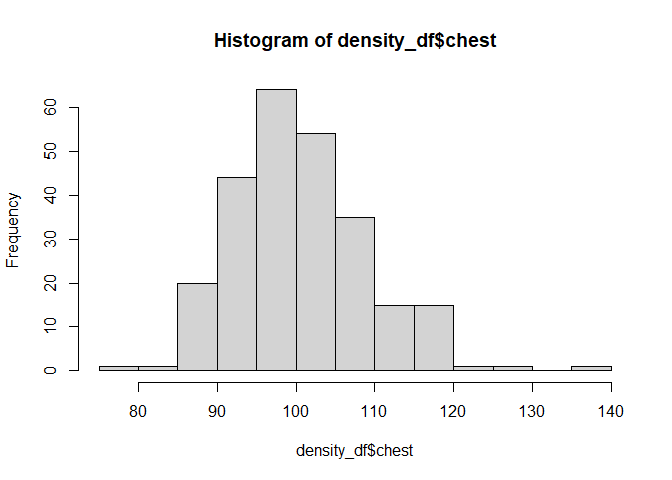
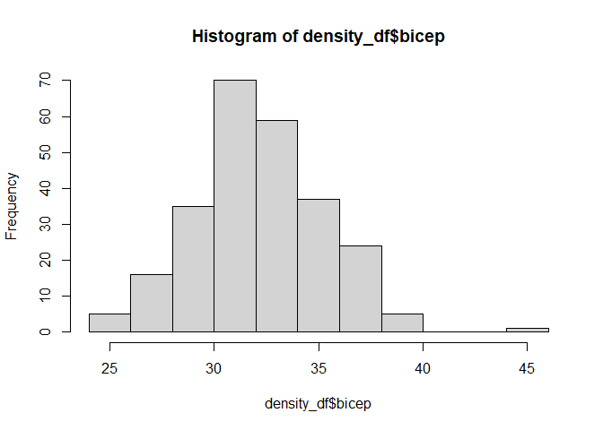

P8130_Final
================
2022-12-11

``` r
# Import dataset
density_df = read_excel("body_density_data.xlsx")
dat.density = as.data.frame(density_df)
```

``` r
# Provide descriptive statistics for all variables of interest
dat.density %>% 
  gtsummary::tbl_summary() %>%
  gtsummary::bold_labels()
```

<div id="pqghcckvhc" style="padding-left:0px;padding-right:0px;padding-top:10px;padding-bottom:10px;overflow-x:auto;overflow-y:auto;width:auto;height:auto;">
<style>html {
  font-family: -apple-system, BlinkMacSystemFont, 'Segoe UI', Roboto, Oxygen, Ubuntu, Cantarell, 'Helvetica Neue', 'Fira Sans', 'Droid Sans', Arial, sans-serif;
}

#pqghcckvhc .gt_table {
  display: table;
  border-collapse: collapse;
  margin-left: auto;
  margin-right: auto;
  color: #333333;
  font-size: 16px;
  font-weight: normal;
  font-style: normal;
  background-color: #FFFFFF;
  width: auto;
  border-top-style: solid;
  border-top-width: 2px;
  border-top-color: #A8A8A8;
  border-right-style: none;
  border-right-width: 2px;
  border-right-color: #D3D3D3;
  border-bottom-style: solid;
  border-bottom-width: 2px;
  border-bottom-color: #A8A8A8;
  border-left-style: none;
  border-left-width: 2px;
  border-left-color: #D3D3D3;
}

#pqghcckvhc .gt_heading {
  background-color: #FFFFFF;
  text-align: center;
  border-bottom-color: #FFFFFF;
  border-left-style: none;
  border-left-width: 1px;
  border-left-color: #D3D3D3;
  border-right-style: none;
  border-right-width: 1px;
  border-right-color: #D3D3D3;
}

#pqghcckvhc .gt_caption {
  padding-top: 4px;
  padding-bottom: 4px;
}

#pqghcckvhc .gt_title {
  color: #333333;
  font-size: 125%;
  font-weight: initial;
  padding-top: 4px;
  padding-bottom: 4px;
  padding-left: 5px;
  padding-right: 5px;
  border-bottom-color: #FFFFFF;
  border-bottom-width: 0;
}

#pqghcckvhc .gt_subtitle {
  color: #333333;
  font-size: 85%;
  font-weight: initial;
  padding-top: 0;
  padding-bottom: 6px;
  padding-left: 5px;
  padding-right: 5px;
  border-top-color: #FFFFFF;
  border-top-width: 0;
}

#pqghcckvhc .gt_bottom_border {
  border-bottom-style: solid;
  border-bottom-width: 2px;
  border-bottom-color: #D3D3D3;
}

#pqghcckvhc .gt_col_headings {
  border-top-style: solid;
  border-top-width: 2px;
  border-top-color: #D3D3D3;
  border-bottom-style: solid;
  border-bottom-width: 2px;
  border-bottom-color: #D3D3D3;
  border-left-style: none;
  border-left-width: 1px;
  border-left-color: #D3D3D3;
  border-right-style: none;
  border-right-width: 1px;
  border-right-color: #D3D3D3;
}

#pqghcckvhc .gt_col_heading {
  color: #333333;
  background-color: #FFFFFF;
  font-size: 100%;
  font-weight: normal;
  text-transform: inherit;
  border-left-style: none;
  border-left-width: 1px;
  border-left-color: #D3D3D3;
  border-right-style: none;
  border-right-width: 1px;
  border-right-color: #D3D3D3;
  vertical-align: bottom;
  padding-top: 5px;
  padding-bottom: 6px;
  padding-left: 5px;
  padding-right: 5px;
  overflow-x: hidden;
}

#pqghcckvhc .gt_column_spanner_outer {
  color: #333333;
  background-color: #FFFFFF;
  font-size: 100%;
  font-weight: normal;
  text-transform: inherit;
  padding-top: 0;
  padding-bottom: 0;
  padding-left: 4px;
  padding-right: 4px;
}

#pqghcckvhc .gt_column_spanner_outer:first-child {
  padding-left: 0;
}

#pqghcckvhc .gt_column_spanner_outer:last-child {
  padding-right: 0;
}

#pqghcckvhc .gt_column_spanner {
  border-bottom-style: solid;
  border-bottom-width: 2px;
  border-bottom-color: #D3D3D3;
  vertical-align: bottom;
  padding-top: 5px;
  padding-bottom: 5px;
  overflow-x: hidden;
  display: inline-block;
  width: 100%;
}

#pqghcckvhc .gt_group_heading {
  padding-top: 8px;
  padding-bottom: 8px;
  padding-left: 5px;
  padding-right: 5px;
  color: #333333;
  background-color: #FFFFFF;
  font-size: 100%;
  font-weight: initial;
  text-transform: inherit;
  border-top-style: solid;
  border-top-width: 2px;
  border-top-color: #D3D3D3;
  border-bottom-style: solid;
  border-bottom-width: 2px;
  border-bottom-color: #D3D3D3;
  border-left-style: none;
  border-left-width: 1px;
  border-left-color: #D3D3D3;
  border-right-style: none;
  border-right-width: 1px;
  border-right-color: #D3D3D3;
  vertical-align: middle;
  text-align: left;
}

#pqghcckvhc .gt_empty_group_heading {
  padding: 0.5px;
  color: #333333;
  background-color: #FFFFFF;
  font-size: 100%;
  font-weight: initial;
  border-top-style: solid;
  border-top-width: 2px;
  border-top-color: #D3D3D3;
  border-bottom-style: solid;
  border-bottom-width: 2px;
  border-bottom-color: #D3D3D3;
  vertical-align: middle;
}

#pqghcckvhc .gt_from_md > :first-child {
  margin-top: 0;
}

#pqghcckvhc .gt_from_md > :last-child {
  margin-bottom: 0;
}

#pqghcckvhc .gt_row {
  padding-top: 8px;
  padding-bottom: 8px;
  padding-left: 5px;
  padding-right: 5px;
  margin: 10px;
  border-top-style: solid;
  border-top-width: 1px;
  border-top-color: #D3D3D3;
  border-left-style: none;
  border-left-width: 1px;
  border-left-color: #D3D3D3;
  border-right-style: none;
  border-right-width: 1px;
  border-right-color: #D3D3D3;
  vertical-align: middle;
  overflow-x: hidden;
}

#pqghcckvhc .gt_stub {
  color: #333333;
  background-color: #FFFFFF;
  font-size: 100%;
  font-weight: initial;
  text-transform: inherit;
  border-right-style: solid;
  border-right-width: 2px;
  border-right-color: #D3D3D3;
  padding-left: 5px;
  padding-right: 5px;
}

#pqghcckvhc .gt_stub_row_group {
  color: #333333;
  background-color: #FFFFFF;
  font-size: 100%;
  font-weight: initial;
  text-transform: inherit;
  border-right-style: solid;
  border-right-width: 2px;
  border-right-color: #D3D3D3;
  padding-left: 5px;
  padding-right: 5px;
  vertical-align: top;
}

#pqghcckvhc .gt_row_group_first td {
  border-top-width: 2px;
}

#pqghcckvhc .gt_summary_row {
  color: #333333;
  background-color: #FFFFFF;
  text-transform: inherit;
  padding-top: 8px;
  padding-bottom: 8px;
  padding-left: 5px;
  padding-right: 5px;
}

#pqghcckvhc .gt_first_summary_row {
  border-top-style: solid;
  border-top-color: #D3D3D3;
}

#pqghcckvhc .gt_first_summary_row.thick {
  border-top-width: 2px;
}

#pqghcckvhc .gt_last_summary_row {
  padding-top: 8px;
  padding-bottom: 8px;
  padding-left: 5px;
  padding-right: 5px;
  border-bottom-style: solid;
  border-bottom-width: 2px;
  border-bottom-color: #D3D3D3;
}

#pqghcckvhc .gt_grand_summary_row {
  color: #333333;
  background-color: #FFFFFF;
  text-transform: inherit;
  padding-top: 8px;
  padding-bottom: 8px;
  padding-left: 5px;
  padding-right: 5px;
}

#pqghcckvhc .gt_first_grand_summary_row {
  padding-top: 8px;
  padding-bottom: 8px;
  padding-left: 5px;
  padding-right: 5px;
  border-top-style: double;
  border-top-width: 6px;
  border-top-color: #D3D3D3;
}

#pqghcckvhc .gt_striped {
  background-color: rgba(128, 128, 128, 0.05);
}

#pqghcckvhc .gt_table_body {
  border-top-style: solid;
  border-top-width: 2px;
  border-top-color: #D3D3D3;
  border-bottom-style: solid;
  border-bottom-width: 2px;
  border-bottom-color: #D3D3D3;
}

#pqghcckvhc .gt_footnotes {
  color: #333333;
  background-color: #FFFFFF;
  border-bottom-style: none;
  border-bottom-width: 2px;
  border-bottom-color: #D3D3D3;
  border-left-style: none;
  border-left-width: 2px;
  border-left-color: #D3D3D3;
  border-right-style: none;
  border-right-width: 2px;
  border-right-color: #D3D3D3;
}

#pqghcckvhc .gt_footnote {
  margin: 0px;
  font-size: 90%;
  padding-left: 4px;
  padding-right: 4px;
  padding-left: 5px;
  padding-right: 5px;
}

#pqghcckvhc .gt_sourcenotes {
  color: #333333;
  background-color: #FFFFFF;
  border-bottom-style: none;
  border-bottom-width: 2px;
  border-bottom-color: #D3D3D3;
  border-left-style: none;
  border-left-width: 2px;
  border-left-color: #D3D3D3;
  border-right-style: none;
  border-right-width: 2px;
  border-right-color: #D3D3D3;
}

#pqghcckvhc .gt_sourcenote {
  font-size: 90%;
  padding-top: 4px;
  padding-bottom: 4px;
  padding-left: 5px;
  padding-right: 5px;
}

#pqghcckvhc .gt_left {
  text-align: left;
}

#pqghcckvhc .gt_center {
  text-align: center;
}

#pqghcckvhc .gt_right {
  text-align: right;
  font-variant-numeric: tabular-nums;
}

#pqghcckvhc .gt_font_normal {
  font-weight: normal;
}

#pqghcckvhc .gt_font_bold {
  font-weight: bold;
}

#pqghcckvhc .gt_font_italic {
  font-style: italic;
}

#pqghcckvhc .gt_super {
  font-size: 65%;
}

#pqghcckvhc .gt_footnote_marks {
  font-style: italic;
  font-weight: normal;
  font-size: 75%;
  vertical-align: 0.4em;
}

#pqghcckvhc .gt_asterisk {
  font-size: 100%;
  vertical-align: 0;
}

#pqghcckvhc .gt_indent_1 {
  text-indent: 5px;
}

#pqghcckvhc .gt_indent_2 {
  text-indent: 10px;
}

#pqghcckvhc .gt_indent_3 {
  text-indent: 15px;
}

#pqghcckvhc .gt_indent_4 {
  text-indent: 20px;
}

#pqghcckvhc .gt_indent_5 {
  text-indent: 25px;
}
</style>
<table class="gt_table">
  
  <thead class="gt_col_headings">
    <tr>
      <th class="gt_col_heading gt_columns_bottom_border gt_left" rowspan="1" colspan="1" scope="col" id="&lt;strong&gt;Characteristic&lt;/strong&gt;"><strong>Characteristic</strong></th>
      <th class="gt_col_heading gt_columns_bottom_border gt_center" rowspan="1" colspan="1" scope="col" id="&lt;strong&gt;N = 252&lt;/strong&gt;&lt;sup class=&quot;gt_footnote_marks&quot;&gt;1&lt;/sup&gt;"><strong>N = 252</strong><sup class="gt_footnote_marks">1</sup></th>
    </tr>
  </thead>
  <tbody class="gt_table_body">
    <tr><td headers="label" class="gt_row gt_left" style="font-weight: bold;">id</td>
<td headers="stat_0" class="gt_row gt_center">126 (64, 189)</td></tr>
    <tr><td headers="label" class="gt_row gt_left" style="font-weight: bold;">bodyfat_brozek</td>
<td headers="stat_0" class="gt_row gt_center">19 (13, 25)</td></tr>
    <tr><td headers="label" class="gt_row gt_left" style="font-weight: bold;">bodyfat_siri</td>
<td headers="stat_0" class="gt_row gt_center">19 (12, 25)</td></tr>
    <tr><td headers="label" class="gt_row gt_left" style="font-weight: bold;">body_density</td>
<td headers="stat_0" class="gt_row gt_center">1.055 (1.041, 1.070)</td></tr>
    <tr><td headers="label" class="gt_row gt_left" style="font-weight: bold;">age</td>
<td headers="stat_0" class="gt_row gt_center">43 (36, 54)</td></tr>
    <tr><td headers="label" class="gt_row gt_left" style="font-weight: bold;">weight</td>
<td headers="stat_0" class="gt_row gt_center">176 (159, 197)</td></tr>
    <tr><td headers="label" class="gt_row gt_left" style="font-weight: bold;">height</td>
<td headers="stat_0" class="gt_row gt_center">70.00 (68.25, 72.25)</td></tr>
    <tr><td headers="label" class="gt_row gt_left" style="font-weight: bold;">neck</td>
<td headers="stat_0" class="gt_row gt_center">38.00 (36.40, 39.42)</td></tr>
    <tr><td headers="label" class="gt_row gt_left" style="font-weight: bold;">chest</td>
<td headers="stat_0" class="gt_row gt_center">100 (94, 105)</td></tr>
    <tr><td headers="label" class="gt_row gt_left" style="font-weight: bold;">abdomen</td>
<td headers="stat_0" class="gt_row gt_center">91 (85, 99)</td></tr>
    <tr><td headers="label" class="gt_row gt_left" style="font-weight: bold;">hip</td>
<td headers="stat_0" class="gt_row gt_center">99 (96, 104)</td></tr>
    <tr><td headers="label" class="gt_row gt_left" style="font-weight: bold;">thigh</td>
<td headers="stat_0" class="gt_row gt_center">59.0 (56.0, 62.3)</td></tr>
    <tr><td headers="label" class="gt_row gt_left" style="font-weight: bold;">knee</td>
<td headers="stat_0" class="gt_row gt_center">38.50 (36.98, 39.92)</td></tr>
    <tr><td headers="label" class="gt_row gt_left" style="font-weight: bold;">ankle</td>
<td headers="stat_0" class="gt_row gt_center">22.80 (22.00, 24.00)</td></tr>
    <tr><td headers="label" class="gt_row gt_left" style="font-weight: bold;">bicep</td>
<td headers="stat_0" class="gt_row gt_center">32.05 (30.20, 34.32)</td></tr>
    <tr><td headers="label" class="gt_row gt_left" style="font-weight: bold;">forearm</td>
<td headers="stat_0" class="gt_row gt_center">28.70 (27.30, 30.00)</td></tr>
    <tr><td headers="label" class="gt_row gt_left" style="font-weight: bold;">wrist</td>
<td headers="stat_0" class="gt_row gt_center">18.30 (17.60, 18.80)</td></tr>
  </tbody>
  
  <tfoot class="gt_footnotes">
    <tr>
      <td class="gt_footnote" colspan="2"><sup class="gt_footnote_marks">1</sup> Median (IQR)</td>
    </tr>
  </tfoot>
</table>
</div>

``` r
# Pairwise association
dat.density %>% 
  select(-id, -bodyfat_siri, -body_density) %>% 
  relocate(`bodyfat_brozek`) %>% 
  ggpairs()
```

<!-- -->

``` r
# Checking normality
hist(density_df$age)
```

<!-- -->

``` r
hist(density_df$weight)
```

<!-- -->

``` r
hist(density_df$height)
```

<!-- -->

``` r
hist(density_df$neck)
```

<!-- -->

``` r
hist(density_df$chest)
```

<!-- -->

``` r
hist(density_df$abdomen)
```

<!-- -->

``` r
hist(density_df$hip)
```

<!-- -->

``` r
hist(density_df$thigh)
```

<!-- -->

``` r
hist(density_df$knee)
```

<!-- -->

``` r
hist(density_df$ankle)
```

<!-- -->

``` r
hist(density_df$bicep)
```

<!-- -->

``` r
hist(density_df$forearm)
```

<!-- -->

``` r
hist(density_df$wrist)
```

<!-- -->

All distribution of variables seems fairly symmetric and normal
(probably with ourliers in some variables), no transformation required.

``` r
# Check for transformation in predictor
mult.fit = lm(bodyfat_brozek ~ age + weight + height + neck + chest + abdomen + hip + thigh + knee + ankle + bicep + forearm + wrist, data = density_df)

par(mfrow = c(2,2))
plot(mult.fit)
```

<!-- -->

No transformation needed.

``` r
# fit regression using all predictors
summary(mult.fit)
```

    ## 
    ## Call:
    ## lm(formula = bodyfat_brozek ~ age + weight + height + neck + 
    ##     chest + abdomen + hip + thigh + knee + ankle + bicep + forearm + 
    ##     wrist, data = density_df)
    ## 
    ## Residuals:
    ##      Min       1Q   Median       3Q      Max 
    ## -10.2888  -2.6066  -0.1231   2.8961   9.3241 
    ## 
    ## Coefficients:
    ##              Estimate Std. Error t value Pr(>|t|)    
    ## (Intercept) -18.61741   20.55155  -0.906  0.36591    
    ## age           0.05916    0.02982   1.984  0.04843 *  
    ## weight       -0.08857    0.05729  -1.546  0.12346    
    ## height       -0.03676    0.16553  -0.222  0.82446    
    ## neck         -0.44122    0.21821  -2.022  0.04430 *  
    ## chest        -0.01660    0.09562  -0.174  0.86229    
    ## abdomen       0.88625    0.08352  10.611  < 2e-16 ***
    ## hip          -0.18011    0.13412  -1.343  0.18059    
    ## thigh         0.24409    0.13540   1.803  0.07269 .  
    ## knee         -0.01418    0.22949  -0.062  0.95078    
    ## ankle         0.16770    0.20622   0.813  0.41690    
    ## bicep         0.15394    0.15979   0.963  0.33631    
    ## forearm       0.43387    0.18461   2.350  0.01958 *  
    ## wrist        -1.50838    0.49387  -3.054  0.00251 ** 
    ## ---
    ## Signif. codes:  0 '***' 0.001 '**' 0.01 '*' 0.05 '.' 0.1 ' ' 1
    ## 
    ## Residual standard error: 3.992 on 238 degrees of freedom
    ## Multiple R-squared:  0.7485, Adjusted R-squared:  0.7347 
    ## F-statistic: 54.48 on 13 and 238 DF,  p-value: < 2.2e-16

Since we are looking for multiple best subsets, it’s better to use
automatic approach to do model selection.

``` r
# Backward Elimination
step(mult.fit, direction='backward')
```

    ## Start:  AIC=711.28
    ## bodyfat_brozek ~ age + weight + height + neck + chest + abdomen + 
    ##     hip + thigh + knee + ankle + bicep + forearm + wrist
    ## 
    ##           Df Sum of Sq    RSS    AIC
    ## - knee     1      0.06 3792.8 709.28
    ## - chest    1      0.48 3793.2 709.31
    ## - height   1      0.79 3793.5 709.33
    ## - ankle    1     10.54 3803.3 709.98
    ## - bicep    1     14.79 3807.5 710.26
    ## - hip      1     28.74 3821.5 711.18
    ## <none>                 3792.7 711.28
    ## - weight   1     38.08 3830.8 711.79
    ## - thigh    1     51.79 3844.5 712.69
    ## - age      1     62.72 3855.5 713.41
    ## - neck     1     65.15 3857.9 713.57
    ## - forearm  1     88.02 3880.8 715.06
    ## - wrist    1    148.65 3941.4 718.96
    ## - abdomen  1   1794.28 5587.0 806.89
    ## 
    ## Step:  AIC=709.28
    ## bodyfat_brozek ~ age + weight + height + neck + chest + abdomen + 
    ##     hip + thigh + ankle + bicep + forearm + wrist
    ## 
    ##           Df Sum of Sq    RSS    AIC
    ## - chest    1      0.47 3793.3 707.31
    ## - height   1      0.94 3793.7 707.34
    ## - ankle    1     10.60 3803.4 707.98
    ## - bicep    1     14.92 3807.7 708.27
    ## - hip      1     29.07 3821.9 709.20
    ## <none>                 3792.8 709.28
    ## - weight   1     38.83 3831.6 709.85
    ## - thigh    1     56.03 3848.8 710.98
    ## - neck     1     65.52 3858.3 711.60
    ## - age      1     65.97 3858.8 711.63
    ## - forearm  1     88.24 3881.0 713.08
    ## - wrist    1    149.92 3942.7 717.05
    ## - abdomen  1   1794.44 5587.2 804.90
    ## 
    ## Step:  AIC=707.31
    ## bodyfat_brozek ~ age + weight + height + neck + abdomen + hip + 
    ##     thigh + ankle + bicep + forearm + wrist
    ## 
    ##           Df Sum of Sq    RSS    AIC
    ## - height   1      0.60 3793.9 705.35
    ## - ankle    1     10.88 3804.2 706.03
    ## - bicep    1     14.72 3808.0 706.29
    ## - hip      1     28.75 3822.0 707.22
    ## <none>                 3793.3 707.31
    ## - weight   1     55.78 3849.1 708.99
    ## - thigh    1     60.97 3854.2 709.33
    ## - neck     1     65.36 3858.6 709.62
    ## - age      1     65.70 3859.0 709.64
    ## - forearm  1     87.98 3881.3 711.09
    ## - wrist    1    149.58 3942.9 715.06
    ## - abdomen  1   2024.09 5817.4 813.07
    ## 
    ## Step:  AIC=705.35
    ## bodyfat_brozek ~ age + weight + neck + abdomen + hip + thigh + 
    ##     ankle + bicep + forearm + wrist
    ## 
    ##           Df Sum of Sq    RSS    AIC
    ## - ankle    1     11.20 3805.1 704.09
    ## - bicep    1     16.21 3810.1 704.43
    ## - hip      1     28.16 3822.0 705.22
    ## <none>                 3793.9 705.35
    ## - thigh    1     63.66 3857.5 707.55
    ## - neck     1     65.45 3859.3 707.66
    ## - age      1     66.23 3860.1 707.71
    ## - forearm  1     88.14 3882.0 709.14
    ## - weight   1    102.94 3896.8 710.10
    ## - wrist    1    151.52 3945.4 713.22
    ## - abdomen  1   2737.19 6531.1 840.23
    ## 
    ## Step:  AIC=704.09
    ## bodyfat_brozek ~ age + weight + neck + abdomen + hip + thigh + 
    ##     bicep + forearm + wrist
    ## 
    ##           Df Sum of Sq    RSS    AIC
    ## - bicep    1     14.91 3820.0 703.08
    ## - hip      1     29.32 3834.4 704.03
    ## <none>                 3805.1 704.09
    ## - age      1     63.17 3868.2 706.24
    ## - thigh    1     66.76 3871.8 706.48
    ## - neck     1     74.16 3879.2 706.96
    ## - forearm  1     87.57 3892.6 707.83
    ## - weight   1     92.42 3897.5 708.14
    ## - wrist    1    140.36 3945.4 711.22
    ## - abdomen  1   2740.72 6545.8 838.80
    ## 
    ## Step:  AIC=703.08
    ## bodyfat_brozek ~ age + weight + neck + abdomen + hip + thigh + 
    ##     forearm + wrist
    ## 
    ##           Df Sum of Sq    RSS    AIC
    ## <none>                 3820.0 703.08
    ## - hip      1     33.23 3853.2 703.26
    ## - neck     1     67.79 3887.8 705.51
    ## - age      1     67.88 3887.9 705.52
    ## - weight   1     81.50 3901.5 706.40
    ## - thigh    1     90.34 3910.3 706.97
    ## - forearm  1    122.99 3943.0 709.07
    ## - wrist    1    139.46 3959.4 710.12
    ## - abdomen  1   2726.49 6546.5 836.83

    ## 
    ## Call:
    ## lm(formula = bodyfat_brozek ~ age + weight + neck + abdomen + 
    ##     hip + thigh + forearm + wrist, data = density_df)
    ## 
    ## Coefficients:
    ## (Intercept)          age       weight         neck      abdomen          hip  
    ##   -20.06213      0.05922     -0.08414     -0.43189      0.87721     -0.18641  
    ##       thigh      forearm        wrist  
    ##     0.28644      0.48255     -1.40487

``` r
# Check for violations of regression model assumptions
mult.fitfinal = lm(bodyfat_brozek ~ age + weight + neck + abdomen + hip + thigh + forearm + wrist, data = density_df)
par(mfrow = c(2,2))
plot(mult.fitfinal)
```

<!-- -->

``` r
# MLR for final model
multreg_fat = lm(bodyfat_brozek ~ age + weight + neck + abdomen + hip + thigh + forearm + wrist, data = density_df)
summary(multreg_fat)
```

    ## 
    ## Call:
    ## lm(formula = bodyfat_brozek ~ age + weight + neck + abdomen + 
    ##     hip + thigh + forearm + wrist, data = density_df)
    ## 
    ## Residuals:
    ##      Min       1Q   Median       3Q      Max 
    ## -10.0574  -2.7411  -0.1912   2.6929   9.4977 
    ## 
    ## Coefficients:
    ##              Estimate Std. Error t value Pr(>|t|)    
    ## (Intercept) -20.06213   10.84654  -1.850  0.06558 .  
    ## age           0.05922    0.02850   2.078  0.03876 *  
    ## weight       -0.08414    0.03695  -2.277  0.02366 *  
    ## neck         -0.43189    0.20799  -2.077  0.03889 *  
    ## abdomen       0.87721    0.06661  13.170  < 2e-16 ***
    ## hip          -0.18641    0.12821  -1.454  0.14727    
    ## thigh         0.28644    0.11949   2.397  0.01727 *  
    ## forearm       0.48255    0.17251   2.797  0.00557 ** 
    ## wrist        -1.40487    0.47167  -2.978  0.00319 ** 
    ## ---
    ## Signif. codes:  0 '***' 0.001 '**' 0.01 '*' 0.05 '.' 0.1 ' ' 1
    ## 
    ## Residual standard error: 3.965 on 243 degrees of freedom
    ## Multiple R-squared:  0.7467, Adjusted R-squared:  0.7383 
    ## F-statistic: 89.53 on 8 and 243 DF,  p-value: < 2.2e-16

``` r
anova(multreg_fat)
```

    ## Analysis of Variance Table
    ## 
    ## Response: bodyfat_brozek
    ##            Df Sum Sq Mean Sq  F value    Pr(>F)    
    ## age         1 1260.9  1260.9  80.2111 < 2.2e-16 ***
    ## weight      1 5738.4  5738.4 365.0362 < 2.2e-16 ***
    ## neck        1  153.4   153.4   9.7560  0.002004 ** 
    ## abdomen     1 3758.5  3758.5 239.0892 < 2.2e-16 ***
    ## hip         1    6.4     6.4   0.4083  0.523419    
    ## thigh       1  122.0   122.0   7.7632  0.005753 ** 
    ## forearm     1   79.9    79.9   5.0832  0.025050 *  
    ## wrist       1  139.5   139.5   8.8713  0.003190 ** 
    ## Residuals 243 3820.0    15.7                       
    ## ---
    ## Signif. codes:  0 '***' 0.001 '**' 0.01 '*' 0.05 '.' 0.1 ' ' 1

``` r
# Checking to Outliers and Influential Points
plot(mult.fitfinal, which = 4)
```

<!-- -->

``` r
# remove influential points
fitOut = density_df[-c(39,216),]

# fit model with and without influential points
with = lm(bodyfat_brozek ~ age + weight + neck + abdomen + hip + thigh + forearm + wrist, data = density_df)
without = lm(bodyfat_brozek ~ age + weight + neck + abdomen + hip + thigh + forearm + wrist, data = fitOut)
summary(with); summary(without)
```

    ## 
    ## Call:
    ## lm(formula = bodyfat_brozek ~ age + weight + neck + abdomen + 
    ##     hip + thigh + forearm + wrist, data = density_df)
    ## 
    ## Residuals:
    ##      Min       1Q   Median       3Q      Max 
    ## -10.0574  -2.7411  -0.1912   2.6929   9.4977 
    ## 
    ## Coefficients:
    ##              Estimate Std. Error t value Pr(>|t|)    
    ## (Intercept) -20.06213   10.84654  -1.850  0.06558 .  
    ## age           0.05922    0.02850   2.078  0.03876 *  
    ## weight       -0.08414    0.03695  -2.277  0.02366 *  
    ## neck         -0.43189    0.20799  -2.077  0.03889 *  
    ## abdomen       0.87721    0.06661  13.170  < 2e-16 ***
    ## hip          -0.18641    0.12821  -1.454  0.14727    
    ## thigh         0.28644    0.11949   2.397  0.01727 *  
    ## forearm       0.48255    0.17251   2.797  0.00557 ** 
    ## wrist        -1.40487    0.47167  -2.978  0.00319 ** 
    ## ---
    ## Signif. codes:  0 '***' 0.001 '**' 0.01 '*' 0.05 '.' 0.1 ' ' 1
    ## 
    ## Residual standard error: 3.965 on 243 degrees of freedom
    ## Multiple R-squared:  0.7467, Adjusted R-squared:  0.7383 
    ## F-statistic: 89.53 on 8 and 243 DF,  p-value: < 2.2e-16

    ## 
    ## Call:
    ## lm(formula = bodyfat_brozek ~ age + weight + neck + abdomen + 
    ##     hip + thigh + forearm + wrist, data = fitOut)
    ## 
    ## Residuals:
    ##    Min     1Q Median     3Q    Max 
    ## -9.853 -2.617 -0.343  2.634  9.718 
    ## 
    ## Coefficients:
    ##              Estimate Std. Error t value Pr(>|t|)    
    ## (Intercept) -20.36256   10.75583  -1.893  0.05953 .  
    ## age           0.06942    0.02845   2.440  0.01541 *  
    ## weight       -0.06657    0.03707  -1.796  0.07379 .  
    ## neck         -0.36325    0.20984  -1.731  0.08471 .  
    ## abdomen       0.82570    0.06848  12.057  < 2e-16 ***
    ## hip          -0.14683    0.12996  -1.130  0.25966    
    ## thigh         0.29466    0.11999   2.456  0.01477 *  
    ## forearm       0.35391    0.18030   1.963  0.05081 .  
    ## wrist        -1.50790    0.46991  -3.209  0.00151 ** 
    ## ---
    ## Signif. codes:  0 '***' 0.001 '**' 0.01 '*' 0.05 '.' 0.1 ' ' 1
    ## 
    ## Residual standard error: 3.919 on 241 degrees of freedom
    ## Multiple R-squared:  0.7387, Adjusted R-squared:   0.73 
    ## F-statistic: 85.16 on 8 and 241 DF,  p-value: < 2.2e-16

``` r
plot(without)
```

<!-- --><!-- --><!-- --><!-- -->

``` r
# Assessing Multicollinearity

# Calculate the variance inflation factor (VIF)
check_collinearity(without)
```

    ## # Check for Multicollinearity
    ## 
    ## Low Correlation
    ## 
    ##     Term   VIF     VIF 95% CI Increased SE Tolerance Tolerance 95% CI
    ##      age  2.10   [1.78, 2.55]         1.45      0.48     [0.39, 0.56]
    ##  forearm  2.17   [1.83, 2.64]         1.47      0.46     [0.38, 0.55]
    ##   weight 16.20 [12.90, 20.41]         4.02      0.06     [0.05, 0.08]
    ##      hip 11.45 [ 9.16, 14.39]         3.38      0.09     [0.07, 0.11]
    ## 
    ## Moderate Correlation
    ## 
    ##   Term  VIF   VIF 95% CI Increased SE Tolerance Tolerance 95% CI
    ##  wrist 3.00 [2.49, 3.69]         1.73      0.33     [0.27, 0.40]
    ##  thigh 5.74 [4.65, 7.16]         2.40      0.17     [0.14, 0.22]
    ## 
    ## High Correlation
    ## 
    ##     Term  VIF   VIF 95% CI Increased SE Tolerance Tolerance 95% CI
    ##     neck 3.72 [3.05, 4.60]         1.93      0.27     [0.22, 0.33]
    ##  abdomen 7.69 [6.19, 9.63]         2.77      0.13     [0.10, 0.16]

``` r
# Model validation
set.seed(1)
# Use 5-fold validation and create the training sets
train = trainControl(method = "cv", number = 5)
model_density = train(bodyfat_brozek ~ age + weight + neck + abdomen + hip + thigh + forearm + wrist,
data = density_df,
trControl = train,
method = 'lm',
na.action = na.pass)

model_density$finalModel
```

    ## 
    ## Call:
    ## lm(formula = .outcome ~ ., data = dat)
    ## 
    ## Coefficients:
    ## (Intercept)          age       weight         neck      abdomen          hip  
    ##   -20.06213      0.05922     -0.08414     -0.43189      0.87721     -0.18641  
    ##       thigh      forearm        wrist  
    ##     0.28644      0.48255     -1.40487

``` r
print(model_density)
```

    ## Linear Regression 
    ## 
    ## 252 samples
    ##   8 predictor
    ## 
    ## No pre-processing
    ## Resampling: Cross-Validated (5 fold) 
    ## Summary of sample sizes: 202, 203, 202, 200, 201 
    ## Resampling results:
    ## 
    ##   RMSE      Rsquared  MAE     
    ##   4.022872  0.734603  3.277563
    ## 
    ## Tuning parameter 'intercept' was held constant at a value of TRUE
